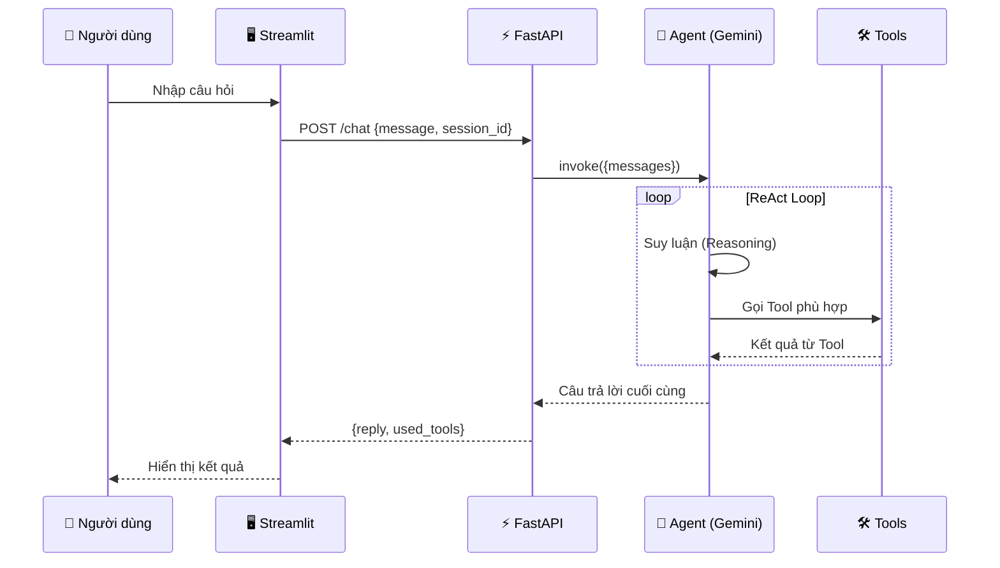

<div align="center">

# 🏦 BankBot — Agentic AI

**Trợ lý ảo ngân hàng thông minh, xây dựng trên kiến trúc Agentic AI**

[](https://python.org)
[](https://langchain.com)
[](https://langchain-ai.github.io/langgraph/)
[](https://ai.google.dev/)
[](https://fastapi.tiangolo.com)
[](https://streamlit.io)
[](https://docker.com)

</div>

---

## 📖 Giới thiệu

**BankBot** là một chatbot hỗ trợ khách hàng ngân hàng, được xây dựng theo kiến trúc **Agentic AI** — nơi một Agent thông minh (LLM) có khả năng **tự suy luận** (Reasoning) và **tự quyết định hành động** (Acting) để chọn công cụ phù hợp nhất cho từng câu hỏi của người dùng.

Thay vì chỉ đơn thuần tìm kiếm từ khoá hoặc trả lời theo kịch bản cố định, BankBot có thể:

- 🔍 **Tra cứu thông tin** sản phẩm ngân hàng từ cơ sở dữ liệu FAQ bằng kỹ thuật **RAG** (Retrieval-Augmented Generation)
- 🧮 **Tính toán lãi vay** trả góp và **lãi tiết kiệm** chính xác bằng công thức tài chính chuẩn
- 💱 **Tra cứu tỷ giá ngoại tệ** thời gian thực qua API bên ngoài

> **📚 Đồ án môn học** — Trường Đại học Công nghiệp Hà Nội (HaUI)

---

## 🏗️ Kiến trúc hệ thống

```
┌──────────────────────────────────────────────────────────────────────┐
│                         NGƯỜI DÙNG (User)                            │
│                    Nhập câu hỏi bằng tiếng Việt                      │
└─────────────────────────────┬────────────────────────────────────────┘
                              │
                              ▼
┌──────────────────────────────────────────────────────────────────────┐
│                    🖥️ STREAMLIT FRONTEND                             │
│              Giao diện chat thân thiện (frontend/app.py)             │
└─────────────────────────────┬────────────────────────────────────────┘
                              │ HTTP POST /chat
                              ▼
┌──────────────────────────────────────────────────────────────────────┐
│                    ⚡ FASTAPI BACKEND                                │
│              REST API + Session Management (src/api/)                │
└─────────────────────────────┬────────────────────────────────────────┘
                              │
                              ▼
┌──────────────────────────────────────────────────────────────────────┐
│                  🧠 LANGGRAPH REACT AGENT                            │
│           Agent tự suy luận & chọn Tool (src/agent/)                 │
│                                                                      │
│    ┌─────────────┐    ┌────────────────┐    ┌──────────────────┐     │
│    │  🔍 RAG     │    │  🧮 Calculator │    │  💱 Exchange     │     │
│    │  Tool       │    │  Tool          │    │  Rate Tool       │     │
│    │             │    │                │    │                  │     │
│    │ Vector DB   │    │ Lãi vay &      │    │ API tỷ giá       │     │
│    │ ChromaDB    │    │ Lãi tiết kiệm  │    │ thời gian thực   │     │
│    └──────┬──────┘    └────────────────┘    └──────────────────┘     │
│           │                                                          │
│           ▼                                                          │
│    ┌─────────────┐                                                   │
│    │  📚 FAQ     │                                                   │
│    │  Data       │                                                   │
│    │  (data/raw) │                                                   │
│    └─────────────┘                                                   │
└──────────────────────────────────────────────────────────────────────┘
```

### Luồng xử lý (ReAct Loop)



1. **Người dùng** gửi câu hỏi qua giao diện Streamlit
2. **Frontend** gọi API `POST /chat` của FastAPI Backend
3. **Agent** (Gemini LLM + LangGraph) nhận câu hỏi → **suy luận** → quyết định gọi tool nào
4. **Tool** thực thi tác vụ (truy vấn vector DB / tính toán / gọi API) và trả kết quả
5. **Agent** tổng hợp kết quả, **sinh câu trả lời** bằng tiếng Việt tự nhiên
6. **Kết quả** trả về Frontend hiển thị cho người dùng

---

## 🛠️ Công nghệ sử dụng

| Thành phần | Công nghệ | Mô tả |
|---|---|---|
| **LLM** | Google Gemini 3.1 Flash Lite | Mô hình ngôn ngữ lớn, xử lý nhanh, chi phí thấp |
| **Agent Framework** | LangChain + LangGraph | Khung xây dựng Agent theo mẫu ReAct |
| **Embedding** | Gemini Embedding 2 | Vector hoá văn bản tiếng Việt cho RAG |
| **Vector Database** | ChromaDB | Lưu trữ & truy vấn embedding vectors |
| **Backend API** | FastAPI + Uvicorn | REST API bất đồng bộ, hiệu suất cao |
| **Frontend** | Streamlit | Giao diện chatbot tương tác, triển khai nhanh |
| **Containerization** | Docker + Docker Compose | Đóng gói & triển khai ứng dụng |
| **Testing** | Pytest | Kiểm thử đơn vị (Unit Test) |
| **HTTP Client** | httpx | Gọi API tỷ giá ngoại tệ bên ngoài |
| **Ngôn ngữ** | Python 3.11 | Ngôn ngữ lập trình chính |

---

## ✨ Tính năng chính

### 🔍 Tra cứu FAQ ngân hàng (RAG)

Sử dụng kỹ thuật **Retrieval-Augmented Generation** — vector hoá toàn bộ dữ liệu FAQ, tìm kiếm ngữ nghĩa (semantic search) rồi đưa kết quả vào context cho LLM sinh câu trả lời:

| Chủ đề | Ví dụ câu hỏi |
|---|---|
| Thẻ tín dụng | Điều kiện mở thẻ? Hạn mức? Phí? Lãi suất? |
| Tiết kiệm | Lãi suất gửi? Các kỳ hạn? Rút trước hạn? |
| Vay vốn | Vay mua nhà? Tiêu dùng? Điều kiện? Hồ sơ? |
| Thông tin chung | Giờ làm việc? Hotline? Phí chuyển tiền? |

**Dữ liệu FAQ:** 4 file văn bản (`faq_chung.txt`, `faq_the_tin_dung.txt`, `faq_tiet_kiem.txt`, `faq_vay_von.txt`) được chia nhỏ thành các đoạn Q&A rồi lưu vào ChromaDB.

### 🧮 Tính toán lãi vay & tiết kiệm

- **Lãi vay trả góp** (`calculate_loan`): Tính số tiền trả hàng tháng (gốc + lãi theo phương pháp trả đều — PMT), tổng tiền trả và tổng lãi phải trả
- **Lãi tiết kiệm** (`calculate_savings_interest`): Tính tiền lãi nhận được cuối kỳ dựa trên công thức lãi đơn

### 💱 Tra cứu tỷ giá ngoại tệ

- Lấy tỷ giá **thời gian thực** từ [exchangerate-api.com](https://exchangerate-api.com) (hỗ trợ USD, EUR, JPY, GBP, CNY, KRW, AUD, SGD, CAD...)
- Tính giá mua vào / bán ra so với VND (biên độ ±0.5%)
- Có **dữ liệu dự phòng** (mock data) khi không có kết nối mạng

---

## 📁 Cấu trúc thư mục

```
bankbot-agentic-ai/
├── 📂 data/
│   ├── raw/                         # Dữ liệu FAQ gốc (.txt)
│   │   ├── faq_chung.txt            #   Thông tin chung ngân hàng
│   │   ├── faq_the_tin_dung.txt     #   FAQ thẻ tín dụng
│   │   ├── faq_tiet_kiem.txt        #   FAQ tiết kiệm
│   │   └── faq_vay_von.txt          #   FAQ vay vốn
│   ├── processed/                   # Dữ liệu đã xử lý
│   └── vector_db/                   # ChromaDB vector store
│
├── 📂 src/                          # Source code chính
│   ├── __init__.py
│   ├── config.py                    # Cấu hình & hằng số toàn cục
│   │
│   ├── 📂 ingestion/               # Pipeline nạp dữ liệu
│   │   ├── loader.py               #   Đọc file .txt từ data/raw
│   │   └── chunker.py              #   Chia nhỏ văn bản theo cặp Q&A
│   │
│   ├── 📂 vectorstore/             # Vector Database
│   │   ├── embedder.py             #   Khởi tạo Gemini Embedding model
│   │   └── store.py                #   Lưu/truy vấn ChromaDB
│   │
│   ├── 📂 tools/                   # Công cụ (Tools) cho Agent
│   │   ├── rag_tool.py             #   🔍 Tra cứu FAQ (RAG)
│   │   ├── loan_calculator_tool.py #   🧮 Tính lãi vay & tiết kiệm
│   │   └── exchange_rate_tool.py   #   💱 Tra cứu tỷ giá ngoại tệ
│   │
│   ├── 📂 agent/                   # Agent thông minh
│   │   ├── prompts.py              #   System Prompt tiếng Việt
│   │   └── agent_executor.py       #   LangGraph ReAct Agent (Singleton)
│   │
│   └── 📂 api/                     # REST API
│       ├── main.py                 #   FastAPI app + endpoints
│       └── schemas.py              #   Pydantic request/response models
│
├── 📂 frontend/
│   └── app.py                      # Giao diện Streamlit (Premium UI)
│
├── 📂 scripts/
│   └── ingest.py                   # Script nạp dữ liệu FAQ → Vector DB
│
├── 📂 tests/                       # Kiểm thử đơn vị
│   ├── test_tools.py               #   Test từng tool riêng lẻ
│   └── test_agent.py               #   Test agent routing
│
├── .env.example                    # Mẫu biến môi trường
├── .gitignore
├── Dockerfile                      # Docker image (Python 3.11-slim)
├── docker-compose.yml              # Docker Compose orchestration
├── requirements.txt                # Thư viện Python
└── README.md                       # ← Bạn đang đọc file này
```

---

## 🚀 Cài đặt & Chạy

### Yêu cầu hệ thống

- Python 3.11+
- Git
- Google Gemini API Key (miễn phí tại [ai.google.dev](https://ai.google.dev/))
- *(Tuỳ chọn)* Docker & Docker Compose

### Cách 1: Chạy thủ công (Development)

```bash
# 1. Clone repository
git clone https://github.com/nam101nam/bankbot-agentic-ai.git
cd bankbot-agentic-ai

# 2. Tạo môi trường ảo
python -m venv venv
source venv/bin/activate        # Linux/Mac
# venv\Scripts\activate         # Windows

# 3. Cài đặt thư viện
pip install -r requirements.txt

# 4. Cấu hình biến môi trường
cp .env.example .env
# Mở file .env và điền GEMINI_API_KEY của bạn

# 5. Nạp dữ liệu FAQ vào Vector Database
python scripts/ingest.py

# 6. Khởi chạy Backend API (Terminal 1)
uvicorn src.api.main:app --reload --port 8000

# 7. Khởi chạy Frontend (Terminal 2)
streamlit run frontend/app.py
```

Sau khi khởi chạy:
- **Backend API:** http://localhost:8000
- **API Docs (Swagger):** http://localhost:8000/docs
- **Frontend Streamlit:** http://localhost:8501

### Cách 2: Chạy bằng Docker (Production)

```bash
# 1. Cấu hình biến môi trường
cp .env.example .env
# Mở file .env và điền GEMINI_API_KEY

# 2. Build và chạy bằng Docker Compose
docker-compose up --build

# Backend API sẽ chạy tại: http://localhost:8000
```

> **Lưu ý:** Khi chạy Docker, dữ liệu FAQ sẽ được tự động nạp vào Vector DB trong quá trình build image. Thư mục `data/` được mount dưới dạng volume để dữ liệu không bị mất khi container restart.

---

## ⚙️ Cấu hình

### Biến môi trường (`.env`)

| Biến | Mô tả | Mặc định |
|---|---|---|
| `GEMINI_API_KEY` | API Key của Google Gemini | *(bắt buộc)* |
| `VECTOR_DB_DIR` | Đường dẫn lưu ChromaDB | `./data/vector_db` |
| `API_HOST` | Host cho FastAPI server | `0.0.0.0` |
| `API_PORT` | Port cho FastAPI server | `8000` |

### Tham số hệ thống (`src/config.py`)

| Tham số | Giá trị | Mô tả |
|---|---|---|
| `LLM_MODEL_NAME` | `gemini-3.1-flash-lite` | Mô hình LLM chính |
| `EMBEDDING_MODEL_NAME` | `gemini-embedding-2` | Mô hình Embedding |
| `CHUNK_SIZE` | `300` | Kích thước mỗi đoạn văn bản |
| `CHUNK_OVERLAP` | `50` | Số ký tự chồng lấp giữa các đoạn |

---

## 🧪 Demo & Ví dụ

### Test API bằng cURL

```bash
# Health check
curl http://localhost:8000/health

# Hỏi FAQ ngân hàng
curl -X POST http://localhost:8000/chat \
  -H "Content-Type: application/json" \
  -d '{"message": "Điều kiện mở thẻ tín dụng là gì?"}'

# Tính lãi vay
curl -X POST http://localhost:8000/chat \
  -H "Content-Type: application/json" \
  -d '{"message": "Tôi vay 500 triệu, lãi suất 8.5%/năm, trong 10 năm. Tính tiền trả hàng tháng?"}'

# Tra cứu tỷ giá
curl -X POST http://localhost:8000/chat \
  -H "Content-Type: application/json" \
  -d '{"message": "Tỷ giá USD hôm nay bao nhiêu?"}'
```

### Ví dụ Response

```json
{
  "reply": "Dạ, theo thông tin từ ngân hàng, tỷ giá USD/VND hôm nay như sau:\n- Giá mua vào: 25,870.00 VNĐ\n- Giá bán ra: 26,130.00 VNĐ\nQuý khách có cần hỗ trợ thêm gì không ạ?",
  "session_id": "a1b2c3d4-...",
  "used_tools": ["get_exchange_rate"]
}
```

---

## 🧪 Kiểm thử (Testing)

```bash
# Chạy tất cả test
pytest tests/ -v

# Chạy test riêng cho tools
pytest tests/test_tools.py -v

# Chạy test riêng cho agent routing
pytest tests/test_agent.py -v
```

---

## 🔮 Hướng phát triển

- 🤖 **Multi-Agent** — Chia thành nhiều agent chuyên biệt (tư vấn vay, tư vấn tiết kiệm, hỗ trợ kỹ thuật)
- 📊 **Thêm công cụ** — Tra cứu lịch sử giao dịch, kiểm tra số dư, theo dõi biến động lãi suất
- ☁️ **Deploy Cloud** — Triển khai trên Google Cloud Run, AWS hoặc Azure
- 🗄️ **Database thật** — Tích hợp PostgreSQL / Redis thay cho in-memory session
- 🔐 **Xác thực** — Thêm JWT authentication cho API
- 📱 **Mobile App** — Phát triển ứng dụng di động React Native / Flutter

---

## 📝 Giấy phép

Dự án phục vụ mục đích **học tập và nghiên cứu** trong khuôn khổ đồ án môn học tại Trường Đại học Công nghiệp Hà Nội.

---

<div align="center">

**Được xây dựng với ❤️ bởi sinh viên HaUI**

*BankBot Agentic AI — 2025*

</div>
